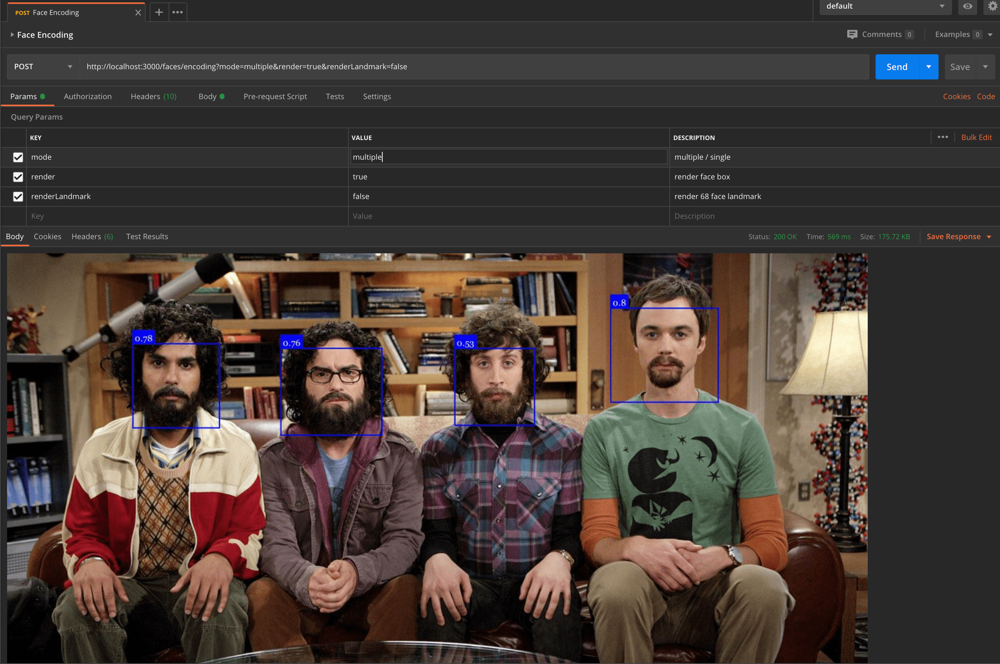
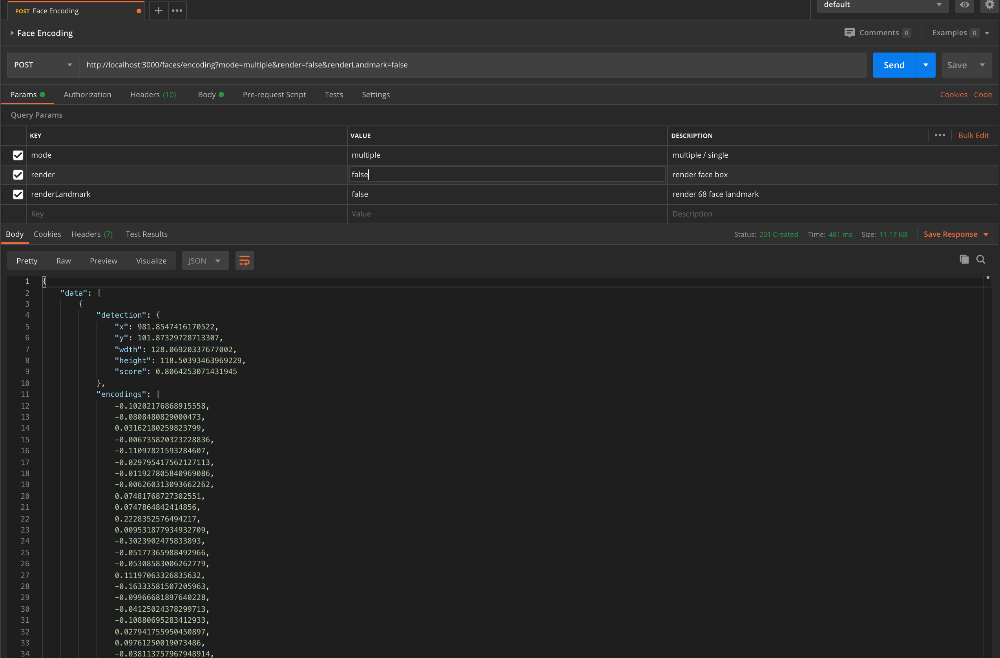

<p align="center">
  <a href="http://nestjs.com/" target="blank"></a>
</p>

# Description

Nest Face API using Tensorflow and face-api.js (dlib wrapper).

## Installation

```bash
# clone this project
$ git clone https://github.com/ahmadarif/nest-face-api.git

# install dependency
$ npm install

# setup environment variables
$ cp .env.example .env
```

## Running the app

```bash
# development
$ npm run start

# watch mode
$ npm run serve

# production mode
$ npm run start:prod
```

## Build the app

```bash
npm run build
```

## Test

```bash
# unit tests
$ npm run test

# e2e tests
$ npm run test:e2e

# test coverage
$ npm run test:cov
```

## Screenshot App

### Render Mode (render = true or renderLandmark = true)



### Data Mode (all render options are false)



## Postman Project

Download this postman collection for check the API docs [download link](nest-face-api.postman_collection.json)